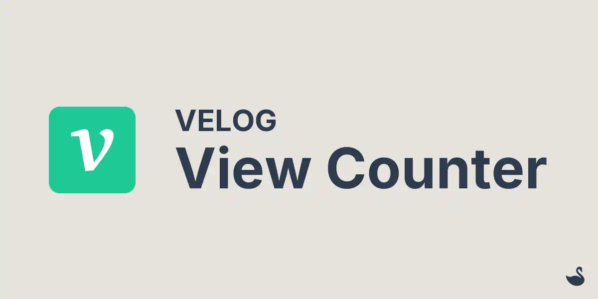

# velog-view-counter



## 개요

Cloudflare Workers를 이용해서 Velog 방문자 확인에 사용할 수 있는 페이지 뷰 카운터를 소개합니다.

Workers, KV, Wrangler 등 Cloudflare 개발자 플랫폼에 익숙하지 않으신 분들은 아래 게시글들을 참고하여주시기 바랍니다.

- [Cloudflare Workers & KV 이용해서 서버리스 방문자 카운팅 API 만들기(1/2)](https://blog.day1swhan.com/articles/cloudflare-workers-01): Workers, Workers KV 소개, 사용법 및 배포 방법을 설명합니다

- [Cloudflare Workers & KV 이용해서 서버리스 방문자 카운팅 API 만들기(2/2)](https://blog.day1swhan.com/articles/cloudflare-workers-02): CORS, 사용자 소유 도메인 적용 및 SSG(Static Site Generation) 빌드 블로그 통합 방법을 설명합니다

- [Cloudflare Workers로 Express.js 스타일 API Gateway 프레임워크 만들기](https://blog.day1swhan.com/articles/cf-worker-api-gateway): **velog-view-counter**는 API 요청을 처리하기 위해서 [Express.js 스타일의 Workers API Gateway](https://github.com/day1swhan/cf-worker-api-gateway)를 사용합니다. 내부적인 작동 방식과 미들웨어 확장 방법을 설명합니다

### 개발 배경 및 아이디어

- [velog](https://velog.io)에 작성한 게시글들 조회수가 궁금한데 매번 로그인해서 들어가기 귀찮음

- 조회수 API를 제공하면 개발자답게 자동 알림 전송을 구현할 수 있음. velog 내부 API 리버싱이 더 귀찮은 작업 같음

- 하지만 velog는 Markdown 문법을 이용한 게시글 작성을 지원함

- 브라우저는 cross-site 도메인이여도 단순 이미지 호출에 대해서는 차단하지 않음

- 게시글을 작성할 때 1x1 픽셀의 투명 이미지를 첨부하면, 게시글이 조회될 때마다 서버 측에서 호출 기록을 남길 수 있음

### 작동 방식

- 이미지에 **식별 값**(slug)을 부여 후 CDN이 아닌 프로그래밍 가능한 Workers를 이용해 응답을 제공하고, 식별 값을 key로 사용해서 호출 기록을 카운팅하면 게시글의 대략적인 페이지 뷰를 구할 수 있음

- 대부분의 Velog 유저들의 게시글은 하루 1,000명 이상의 방문자가 나오지 않음

  - 이 정도 트래픽에는 Workers KV를 이용해도 충분함

- **날짜**, **ip**, **userAgent**, **이미지 식별 값**을 `Hash` 함수를 이용해 key 값으로 만들면 최소한의 중복 방문 처리가 가능함

  - **HASH**: SHA-256 기반 128비트 해시를 base64url(22자)로 인코딩.
  - **KEY**: `view:${slug}:${hash}`.
  - **VALUE**: UserAgent, Date...

- Workers KV 무료 플랜은 하루 1,000개의 PUT, LIST를 지원함.

  - **PUT**: 하루 **1,000개**의 방문자 카운팅 정보를 **저장 가능**
  - **LIST**: 하루 **1,000개 이상**의 페이지 뷰 정보를 **제공 가능**

- 페이지 뷰 조회 요청에는 LIST 명령을 사용하는데, 식별값(slug) 정보를 `prefix`로 이용해서 가져온 후 이를 단순 카운팅하면 됨

  - 페이지 뷰 조회는 실시간성이 크게 중요하지 않으니 응답 값을 적절히 Cache하면 하루 1,000개 이상의 요청 처리가 가능해짐

### 한계

- **Eventual consistency**: Workers KV PUT 요청은 실시간이 아님. 실시간성이 꼭 필요한 사람이라면 [Durable Objects(DO)](https://developers.cloudflare.com/durable-objects/concepts/what-are-durable-objects/)를 사용해야 함

- **LIST Command**: LIST 명령을 이용한 카운팅 방식은 (페이지 뷰가 꾸준히 나온다는 가정하에)결국 시간이 지날수록 느려짐. DO 또는 [Analytics Engine](https://developers.cloudflare.com/analytics/analytics-engine/) 사용을 고려해야 함

### 지원 예정

- **Rate Limit**: 만약 본인이 인싸 velog 유저라면 시기와 질투에 눈이 먼 사용자들이 악의적 요청을 날릴 수 있음. 대비책이 필요함
- **날짜별 검색**: API 추가로 지원할 예정. 데이터, 저장소 구조가 바뀔 수 있음
- **세션별 검색**: API 추가로 지원할 예정. 현재 세션 정보는 각 포스팅에 대해서만 유효함. 개인정보보호 정책 검토 후 제공 예정
- **기기별 검색**: API 추가로 지원할 예정. UserAgent 기반으로 대략적인 디바이스/브라우저/OS 파싱이 가능함
- **서비스 API 제공**: 누구나 쉽게 이메일 인증만으로 사용할 수 있도록 API를 서비스 형태로 제공
  - **웹훅/이메일**: 페이지 뷰 이벤트 발생시 요청 전송
  - **custom campaign**: velog 포스팅별 설정된 이벤트(ex. 특정 조회수 도달)가 통합된 이미지 식별 값(slug) 제공

## API Reference

### 트래킹 픽셀 등록

```sh
GET /view.png?id={postId}
```

Velog 게시글의 조회를 기록하기 위한 트래킹 픽셀. 포스팅 작성 시 Markdown 문법을 이용해서 등록하면 됨

```md

```

- 본문은 1x1 PNG 이미지 데이터
- Worker KV에 새로운 세션(조회) 정보가 비동기로 저장됨

```sh
HTTP/1.1 200 OK
Content-Type: image/png
...
Cache-Control: no-store, no-cache, must-revalidate, max-age=0
```

### 페이지 뷰 조회

```sh
GET /posts/{postId}/views
```

특정 게시글의 총 조회수 및 캐시 상태를 조회

```sh
HTTP/1.1 200 OK
Content-Type: application/json
...
x-cache: MISS # "HIT" 또는 "MISS" / 첫 요청 이후 5분간 캐싱
```

```json
{
  "id": "my-post-slug",
  "pageCount": 1,
  "page": {
    "has_more": false
  },
  "lastUpdate": "2025-10-14TXX:XX:XX.XXXZ",
};
```

### 페이지 세션 조회

```sh
GET /posts/{postId}/sessions
```

특정 게시글에 기록된 세션 ID 목록을 조회

```sh
HTTP/1.1 200 OK
Content-Type: application/json
...
x-cache: MISS # "HIT" 또는 "MISS" / 첫 요청 이후 5분간 캐싱
```

```json
{
  "id": "my-post-slug",
  "pageCount": 1,
  "data": [
    { "sid": "so0MIeFLTVg-fO82o51oxA" }
  ],
  "page": {
    "has_more": false
   },
  "lastUpdate": "2025-10-14TXX:XX:XX.XXXZ",
};
```

### 페이지 세션 상세정보 조회

```sh
GET /posts/{postId}/sessions/{sessionId}
```

특정 세션의 상세 정보(UserAgent, Date)를 조회

```sh
HTTP/1.1 200 OK
Content-Type: application/json
...
x-cache: MISS # "HIT" 또는 "MISS" / 첫 요청 이후 5분간 캐싱
```

```json
{
  "sid": "so0MIeFLTVg-fO82o51oxA",
  "userAgent": "curl/8.7.1",
  "date": "2025-10-14TXX:XX:XX.XXXZ",
};
```

## Quick Start

### Installation

프로젝트 clone

```sh
git clone https://github.com/day1swhan/velog-view-counter.git --depth=1 && \
cd velog-view-counter
```

필요 모듈 설치, 타입 생성

```sh
npm install && npm run types
```

## 개발 모드

로컬에서 개발 모드 실행

```sh
npm run dev

Your Worker has access to the following bindings:
Binding                         Resource          Mode
env.WORKERS_KV (1234567890)     KV Namespace      local

⎔ Starting local server...
[wrangler:info] Ready on http://localhost:8787
```

페이지 뷰 정보를 직접 생성하고 테스트 가능

```sh
curl -s -o /dev/null -D - 'http://localhost:8787/view.png?id=my-post-slug'
```

## 프로덕션 모드

### 계정 API 토큰 발급

wrangler를 이용한 cli 환경에서 배포하기 위해서는 API 토큰 발급 후 환경변수에 등록해 줘야 합니다.

[cloudflare dashboard](https://dash.cloudflare.com/) - 계정 관리 - 계정 API 토큰 - 사용자 설정 토큰 생성

편집 권한(계정 단위)

- Workers KV 저장 공간
- Workers 스크립트
- Workers 경로: 편집 (선택. 사용자 소유 도메인 이용할 경우)

### API Token 환경변수 등록

```sh
# bash
export CLOUDFLARE_API_TOKEN="xxxxxxxxxx"
```

### Account ID 환경변수 등록

```sh
npx wrangler whoami

export CLOUDFLARE_ACCOUNT_ID="**********"
```

### KV Namespace 생성

Workers KV는 스크립트 배포시 자동으로 생성되지 않아서 직접 `wrangler`를 이용해서 생성해줘야 합니다.

```sh
npx wrangler kv namespace create VELOG_VIEW_COUNTER_KV
```

```sh
Resource location: remote
🌀 Creating namespace with title "VELOG_VIEW_COUNTER_KV"

...

✨ Success!
Add the following to your configuration file in your kv_namespaces array:
{
  "kv_namespaces": [
    {
      "binding": "VELOG_VIEW_COUNTER_KV",
      "id": "9876543210" // 프로덕션용 ID. 이걸 복사&붙여넣기
    }
  ]
}
```

### KV Namespace 적용

Workers가 배포 후 KV 저장소에 접근할 수 있도록 `wrangler.jsonc` 파일에 방금 생성된 `id` 값을 반영해 줍니다.

```json
// wrangler.jsonc
{
  "name": "velog-view-counter",
  ...
  "kv_namespaces": [
    {
      "binding": "WORKERS_KV", // 수정 금지 (index.ts 파일에 통합된 단순 변수임)
      "id": "9876543210", // 프로덕션용, 배포시 포함되어야됨
    }
  ]
}
```

### 배포

Cloudflare가 기본적으로 제공하는 도메인을 사용하시려면 `wrangler.jsonc` 파일에서 `workers_dev` 옵션을 `true`로 설정하시면 됩니다.

```json
// wrangler.jsonc
{
  "name": "velog-view-counter",
  ...
  "workers_dev": true,
}
```

```sh
npm run deploy
```

```sh
Your Worker has access to the following bindings:
Binding                 Resource
env.WORKERS_KV (xxxxx)  KV Namespace

...
Deployed velog-view-counter triggers (1.30 sec)
  https://velog-view-counter.day1swhan.workers.dev
```

### 테스트

페이지 뷰 이벤트 등록

```sh
curl -s -o /dev/null -D - \
-H 'user-agent: local-test' \
-H 'origin: https://velog.io' \
'https://velog-view-counter.day1swhan.workers.dev/view.png?id=hello-world'

HTTP/2 200
...
content-type: image/png
cache-control: no-store, no-cache, must-revalidate, max-age=0
```

페이지 뷰 이벤트 조회

```sh
curl -i \
-H 'user-agent: local-test' \
'https://velog-view-counter.day1swhan.workers.dev/posts/hello-world/views'

HTTP/2 200
content-type: application/json
...
access-control-allow-origin: *
cache-control: public, max-age=300, stale-while-revalidate=300
x-cache: MISS

{"id":"hello-world","pageCount":1,"page":{"has_more":false},"lastUpdate":"2025-10-15T12:19:56.228Z"}
```
